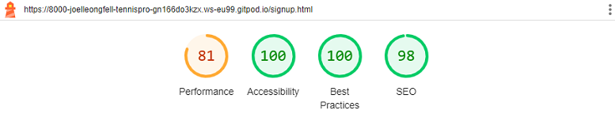

# Tennis Pro
Tennis Pro Academy is a website for people who are looking to start playing tennis. Its a great place for begginers, profetionals, young and old.

## Features
---

### - Navigation
- The Navbar is at the very top of the page it contains some navigation elements to navigate arround the side.
- It has a title that is clickable that brings you back home.
- It has a home button that brings you to the top of the home page.
- It has a gallery button that brings you to the gallery page.
- It has a sign up button that brings you to the sign up page.

### - Hero Image

- The hero image perfectly describes the website!
### - Club Ethos

- The Club Ethos is the main section of the site.
- The Club Ethos tells you why Tennis is good for you. 
- Most importantly why play with Tennis Pro.
### - Meetup Times

- in this section of the wibsite you see the academies schedule.
- You see where you can play.
- you can see when you can play.
### - Gallery

- In the Gallery you see the academies best players!
### - Sgin Up

- In the sign up page you can sign up if you want to become a member at the culb.

- After signing in you will be contacted by the Academy!
### - Footer

- In the footer you can see the social media links.
## Testing
---
The website was tested with chrome, fire fox, microsoft edge and the 
responsivness of it on all screen sizes!

light house test were made too!

### Validator Testing
W3C CSS Validation

W3C HTML Validation

- the warning cant be ignored, as no heading is required for this section.

## Deployment
---
The site was deployed to GitHub pages. The steps to deploy are:

- In the GitHub repository, navigate to the Settings tab.
- From the source section drop-down menu, select the Master Branch.
- Once the Master Branch has been selected, the page provided the link to the completed website.- 
